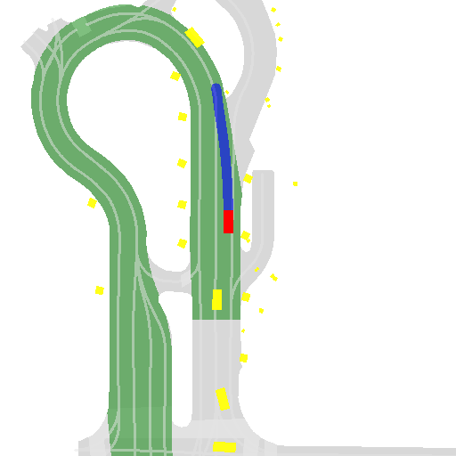
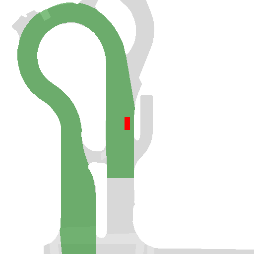
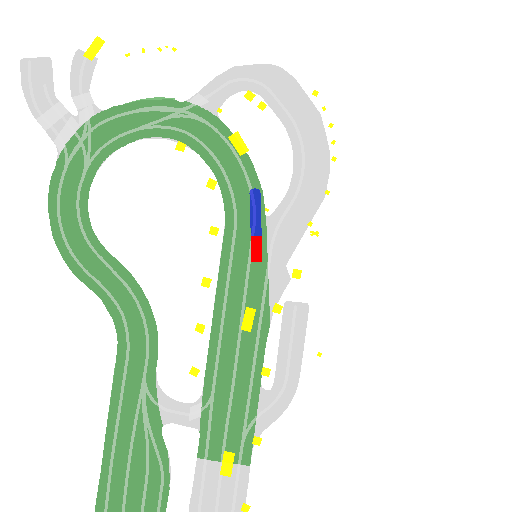
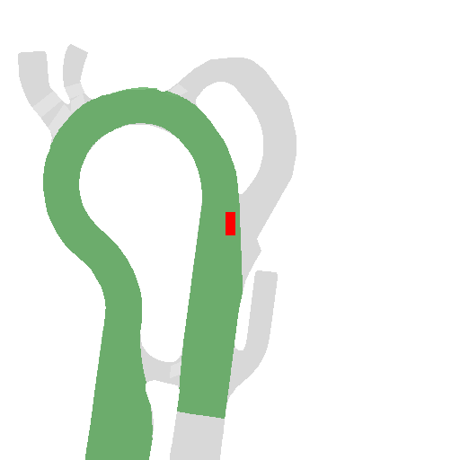
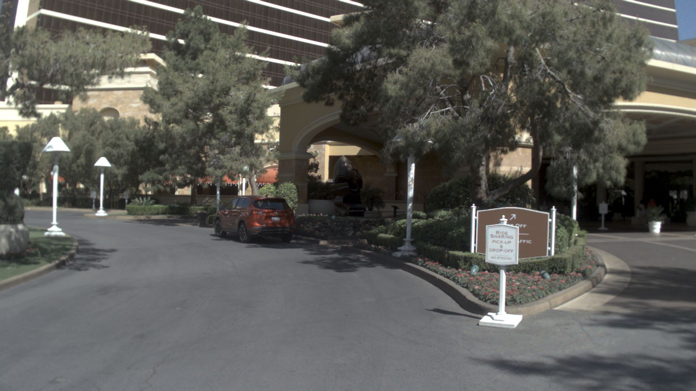

# 慢系统预刷使用文档

---

## 目录
- [慢系统预刷使用文档](#慢系统预刷使用文档)
  - [目录](#目录)
  - [栅格化导航图生成 (tools/nuplan/raster\_navigation.py)](#栅格化导航图生成-toolsnuplanraster_navigationpy)
    - [概述](#概述)
    - [使用方法](#使用方法)
    - [输出结构](#输出结构)
    - [栅格组件](#栅格组件)
  - [VLM 数据标注 (lwad/vlannotator/data\_annotation.py)](#vlm-数据标注-lwadvlannotatordata_annotationpy)
    - [环境配置](#环境配置)
    - [使用方法](#使用方法-1)
    - [API密钥和配置](#api密钥和配置)
      - [智谱AI](#智谱ai)
      - [通义千问](#通义千问)
      - [Azure OpenAI (用于 `gpt-4o`)](#azure-openai-用于-gpt-4o)
    - [故障排除](#故障排除)
  - [标注整合 (lwad/vlannotator/merge\_ann2pickle.py)](#标注整合-lwadvlannotatormerge_ann2picklepy)
    - [功能特点](#功能特点)
    - [使用方法](#使用方法-2)
    - [处理细节](#处理细节)
    - [注意事项](#注意事项)
  - [后处理 (lwad/vlannotator/post\_processing.py)](#后处理-lwadvlannotatorpost_processingpy)
    - [功能特点](#功能特点-1)
    - [元动作类别](#元动作类别)
    - [使用方法](#使用方法-3)
    - [常量和映射](#常量和映射)
      - [META\_ACTIONS](#meta_actions)
      - [EXCEPTION\_MAP](#exception_map)
      - [TARGET\_ACTION\_MAP](#target_action_map)
      - [TARGET\_ACTIONS](#target_actions)
      - [映射流程](#映射流程)
    - [输出格式](#输出格式)
    - [注意](#注意)
  - [标注示范](#标注示范)
    - [输入](#输入)
    - [输出](#输出)

---


## 栅格化导航图生成 (tools/nuplan/raster_navigation.py)

### 概述
该工具用于从 NuPlan 数据集生成驾驶场景的栅格化可视化图像。它可以生成两种类型的栅格图像：
1. 真实场景（GT）栅格图 - 包含道路地图、可行驶区域、基准路径、其他代理、未来轨迹和自车位置
2. 导航栅格图 - 简化版本，仅包含道路地图、可行驶区域和自车位置

**主要特点**
- 可同时生成静态图像（PNG）和视频序列（MP4）
- 支持多进程处理以加快批处理速度
- 创建具有半透明图层的 RGBA 图像，提供更好的可视化效果
- 处理多个地图位置和坐标转换

### 使用方法

**基本命令**

````bash
python tools/nuplan/raster_navigation.py \
    --ann_dir /path/to/nuplan/annotations \
    --save_dir /path/to/output/raster \
    --nuplan_data_root /path/to/nuplan/dataset \
    --use_multiprocessing
````

**参数说明**

- `--ann_dir`: NuPlan 注释文件目录（*.pkl）
- `--save_dir`: 栅格图像和视频的输出目录
- `--nuplan_data_root`: NuPlan 数据集的根目录
- `--use_multiprocessing`: 启用并行处理（推荐用于大型数据集）
- `--overwrite`: 是否覆盖现有文件（默认：True）

### 输出结构
````
save_dir/
├── gt/
│   └── {log_name}/
│       ├── 0.png
│       ├── 1.png
│       └── 0_video.mp4
└── navigation/
    └── {log_name}/
        ├── 0.png
        ├── 1.png
        └── ...
````

### 栅格组件

**示例**

<table>
  <tr>
    <td></td>
    <td></td>
  </tr>
  <tr>
    <td align="center">GT Raster</td>
    <td align="center">Nav Raster</td>
  </tr>
</table>

<p align="center">
<video width="300" height="250" controls>
  <source src="media/raster/0_video.mp4" type="video/mp4">
  您的浏览器不支持视频
</video>

[视频](docs/media/raster/0_video.mp4)
</p>


**真实场景栅格图层**

1. 道路地图（灰色，半透明）
2. 可行驶区域（绿色）
3. 基准路径（浅灰色）
4. 周边智能体（红色）
5. 未来轨迹（蓝色）
6. 自车位置（红色）

**导航栅格图层**

1. 道路地图（灰色，半透明）
2. 可行驶区域（绿色）
3. 自车位置（红色）


**格式细节**

- 分辨率：512x512 像素
- 范围：x 和 y 方向均为 ±51.2 米
- 格式：RGBA（带透明通道）
- 视频：H.264 编码，10 FPS


## VLM 数据标注 (lwad/vlannotator/data_annotation.py)

介绍用于标注视觉语言模型(VLM)数据集的脚本，利用不同的基于API的语言模型来生成场景描述、场景分析和层次规划标注。该脚本可处理 NuPlan 数据集文件，并支持多进程处理以提高效率。

**注意：** 在运行 VLM 数据标注流程之前，您需要首先通过 `tools/nuplan/raster_navigation.py` 生成栅格化图像。


### 环境配置

运行脚本时确保您在 `vlmdatagen` 目录下。

```sh
cd vlmdatagen
```

如果尚未安装，请安装所需的依赖项。

**配置说明**

选择以下可用的API模型之一进行标注：
- `zhipuai`（智谱AI）
- `qwen`（通义千问）
- `gpt-4o`（Azure OpenAI）

为您选择的模型设置必要的API密钥。将API密钥添加为环境变量。

### 使用方法

```bash
python data_annotation.py \
    --metadata_root /data/ceph/data/nuplan/ann_files/nuplan_test_1111 \
    --save_root /data/ceph/data/nuplan/dataset/vlm_ann_data \
    --nuplan_root /data/ceph/data/nuplan/dataset\
    --raster_path /data/ceph/data/nuplan/dataset/raster/gt \
    --text_path /data/ceph/data/nuplan/cache/text \
    --nuplan_sensor_root /data/ceph \
    --downsample_rate 10 \
    --model gpt-4o \
    --use_multiprocessing
```

**选项说明**

- `--metadata_root`：要标注的元数据文件的根目录路径
- `--save_root`：标注数据将保存的目录
- `--model`：选择用于标注的模型（默认：`gpt-4o`）
- `--nuplan_root`：NuPlan数据集根目录路径
- `--raster_path`：用于场景分析的光栅图像根目录路径
- `--text_path`：保存基于文本标注的缓存路径
- `--nuplan_sensor_root`：NuPlan传感器数据根目录路径
- `--use_multiprocessing`：使用多进程加速标注过程
- `--downsample_rate`：设置标注时的帧索引间隔进行降采样

### API密钥和配置

对于每个模型，按如下方式设置API密钥：

#### 智谱AI
```sh
export ZHIPUAI_API_KEY=<您的API密钥>
```

#### 通义千问
```sh
export DASHSCOPE_API_KEY=<您的API密钥>
```

#### Azure OpenAI (用于 `gpt-4o`)
```sh
export AZURE_OPENAI_API_KEY=<您的API密钥>
```

*对于Azure，您还必须在 `api/config.py` 中通过设置 `AZURE_ENDPOINT` 变量提供端点。*

```python
AZURE_ENDPOINT = "您的AZURE端点"
```

> 注意：OpenAI在某些地区受限。如果无法访问OpenAI，建议使用Azure OpenAI作为替代方案。

**如果可以使用OpenAI密钥，推荐使用OPENAI API密钥**

```sh
export OPENAI_API_KEY=<您的API密钥>
```

### 故障排除

- 确保所有环境变量都正确设置
- 使用 `--use_multiprocessing` 标志来利用所有CPU核心，减少处理大型数据集的时间
- 确保NuPlan数据集和光栅数据的路径准确，以避免文件未找到错误

---

有关NuPlan数据集或API使用的更多详细信息，请参阅官方文档。


## 标注整合 (lwad/vlannotator/merge_ann2pickle.py)

该脚本将VLM(视觉语言模型)标注与包含帧数据的现有pickle文件合并。它处理时序元动作并将其分配给相应的帧,同时保持场景连续性。

### 功能特点

- 将Arrow数据集的标注与现有pickle文件合并
- 处理各种持续时间格式(秒、分钟、范围)
- 支持多进程以加快处理速度
- 通过分段连续帧来维持场景连续性
- 为帧段生成唯一的场景标识符
- 包含用于调试和监控的综合日志记录

### 使用方法

```bash
python merge_ann2pickle.py \
  --index_root_path /path/to/arrow/dataset \
  --pkl_dir /path/to/pickle/files \
  --output_dir /path/to/output \
  --use_multiprocessing \
  --overwrite False
```

**参数说明**

- `--index_root_path`: 包含带标注的Arrow数据集文件的目录路径
- `--pkl_dir`: 包含原始帧数据pickle文件的目录
- `--output_dir`: 合并后的pickle文件保存目录
- `--use_multiprocessing`: 启用并行处理(True/False)
- `--num_processes`: 用于并行处理的进程数
- `--overwrite`: 是否覆盖输出目录中的现有文件

### 处理细节

1. **数据加载**:
   - 从Arrow数据集加载标注
   - 从pickle文件加载帧数据

2. **帧处理**:
   - 基于时间戳将元动作映射到帧
   - 验证动作持续时间
   - 将元动作分配给相应的帧

3. **场景管理**:
   - 将连续帧分组为段
   - 为每个段生成唯一的场景标识符
   - 维持时间连续性

4. **输出**:
   - 将处理后的帧与合并的标注保存为pickle文件
   - 保持原始帧结构并添加元动作信息

### 注意事项

- 帧时间戳预期以0.5秒为间隔
- 元动作的总持续时间通常应为8秒
- 场景标识符使用UUID5与DNS命名空间生成


## 后处理 (lwad/vlannotator/post_processing.py)

此脚本处理并合并包含驾驶动作的已标注pickle文件，将它们映射到标准化的元动作和目标类别。它执行以下几个关键操作：

### 功能特点
- 将多个已标注的pickle文件合并为单个数据集
- 通过标准化映射处理LLM标注中的异常情况
- 将真实动作映射到预定义的元动作
- 将动作转换为VAD(视觉动作检测)的独热编码向量
- 在添加新映射的同时保留原始指令

### 元动作类别
| **Category**          | **Meta-actions**                                                                                     |
|-----------------------|-----------------------------------------------------------------------------------------------------|
| **Speed-control actions** | Speed up, Slow down, Slow down rapidly, Go straight slowly, Go straight at a constant speed, Stop, Wait, Reverse |
| **Turning actions**    | Turn left, Turn right, Turn around                                                                  |
| **Lane-control actions** | Change lane to the left, Change lane to the right, Shift slightly to the left, Shift slightly to the right      |

### 使用方法
```bash
python post_processing.py [--input_dir INPUT_DIR] [--output_path OUTPUT_PATH]
```

**参数**

- `--input_dir`: 输入pickle文件的目录
- `--output_path`: 输出合并pickle文件的路径

### 常量和映射

该脚本使用几个预定义的集合和字典来标准化和映射驾驶动作：

#### META_ACTIONS
作为所有驾驶指令基础词汇的标准化元动作集合：
```python
META_ACTIONS = {
    # 速度控制动作
    "speed up", "slow down", "slow down rapidly", 
    "go straight slowly", "go straight at a constant speed", 
    "stop", "wait", "reverse",
    
    # 转向动作
    "turn left", "turn right", "turn around",
    
    # 变道动作
    "change lane to the left", "change lane to the right",
    "shift slightly to the left", "shift slightly to the right"
}
```

#### EXCEPTION_MAP
处理来自LLM标注的变体和非标准描述的综合字典。示例包括：
```python
EXCEPTION_MAP = {
    # 速度控制变体
    "accelerate": "speed up",
    "maintain constant speed": "go straight at a constant speed",
    
    # 转向动作变体
    "turn slightly left": "turn left",
    "turn sharply right": "turn right",
    
    # 变道变体
    "slight left shift": "shift slightly to the left",
    "shift to the right lane": "change lane to the right"
    # ... 更多映射
}
```

#### TARGET_ACTION_MAP
将元动作映射到VAD模型使用的五个基本驾驶类别：
```python
TARGET_ACTION_MAP = {
    # 速度控制 -> FORWARD
    "speed up": "FORWARD",
    "slow down": "FORWARD",
    # ... 其他速度控制
    
    # 转向 -> LEFT/RIGHT
    "turn left": "LEFT",
    "turn right": "RIGHT",
    
    # 变道 -> CHANGE_LANE_LEFT/RIGHT
    "change lane to the left": "CHANGE_LANE_LEFT",
    "change lane to the right": "CHANGE_LANE_RIGHT"
}
```

#### TARGET_ACTIONS
用于独热编码的最终动作类别集合：
```python
TARGET_ACTIONS = [
    "FORWARD",
    "LEFT",
    "RIGHT",
    "CHANGE_LANE_LEFT",
    "CHANGE_LANE_RIGHT"
]
```

#### 映射流程
脚本按以下顺序通过这些常量处理动作：
1. 原始LLM标注 → 检查是否在`META_ACTIONS`中
2. 如果不在`META_ACTIONS`中 → 在`EXCEPTION_MAP`中查找
3. 元动作 → 使用`TARGET_ACTION_MAP`映射到目标类别
4. 目标类别 → 使用`TARGET_ACTIONS`顺序转换为独热向量

### 输出格式
该脚本生成的pickle文件包含：
- 带有标准化动作的合并标注数据
- 独热编码的动作向量
- 在`'gt_ego_fut_cmd_old'`中保留的原始指令

### 注意
该脚本包含对各种动作描述的广泛异常处理，将它们映射到标准化的元动作。如果某个动作无法映射，则默认为"匀速直行"。


## 标注示范

### 输入

- 栅格化导航图
<table>
  <tr>
    <td></td>
    <td></td>
  </tr>
</table>

- 前视图
<p align="center">

</p>

- 周边智能体位置 + 自车未来轨迹

    **周边智能体位置**

    ```txt
    the agent vehicle is at the relative place of [-12.74292427   1.60909977   0.59066798](x, y, z, yaw) with a velocity of [ 5.772881   -1.46567585]. 

    the agent vehicle is at the relative place of [22.32896777  3.54098596  0.4936792 ](x, y, z, yaw) with a velocity of [0. 0.]. 

    the agent pedestrian is at the relative place of [-19.82714725 -12.62536604   0.57308599](x, y, z, yaw) with a velocity of [-1.27870745  0.54293116].'
    ```

    **未来轨迹**

    ```python
    array([[ -0.069226  ,  -3.4932909 ],
        [ -0.10945714,  -6.587286  ],
        [ -0.10530278,  -8.98278713],
        [ -0.13126345, -10.56684048],
        [ -0.21061738, -11.61922697],
        [ -0.28171157, -12.34536882],
        [ -0.28752556, -12.5322639 ],
        [ -0.28269216, -12.50150055]])
    ```

- Prompt： 参考代码

### 输出

```json
{
    "Scene_Summary": "The scene is set on a clear daytime urban road at the entrance of a curve. There are critical objects, including a parked vehicle and a building entrance, that the ego vehicle must navigate around. Additionally, a vehicle and multiple pedestrians are observed in the environment with varying velocities, suggesting potential interactions at a pickup or drop-off location.",
    "Critical_Objects": [
        {
            "class": "Parked Vehicle",
            "Characteristics": {
                "Static attributes": "The vehicle is parked near the entrance, indicating it may not move immediately.",
                "Motion states": "Located at approximately (0.4, 0.6) in relation to the ego car, suggesting it's in the lane but stationary.",
                "Particular behaviors": "Potential obstacle if the ego vehicle needs to enter or exit the curve."
            },
            "Influence": "May require the ego vehicle to maneuver around it, possibly reducing speed and increasing caution."
        },
        {
            "class": "Building Entrance",
            "Characteristics": {
                "Static attributes": "Situated at (0.57, 0.5) relative to the ego vehicle, representing a noteworthy structure in the environment.",
                "Motion states": "Static location potentially indicating a spot for passenger drop-off or pickup.",
                "Particular behaviors": "Could denote intended stopping point if ego vehicle is on a service route."
            },
            "Influence": "May involve a change in routing or stopping if interaction is necessary."
        },
        {
            "class": "Moving Vehicle",
            "Characteristics": {
                "Static attributes": "A vehicle traveling on the road.",
                "Motion states": "Positioned at (-16.19, 2.52) and moving with a velocity of (4.88, -0.09), indicating it's on a trajectory parallel to the main road.",
                "Particular behaviors": "Consistent speed suggests it will continue on its path without interference."
            },
            "Influence": "Could require the ego vehicle to yield or adjust its path if the moving vehicle merges onto the same path."
        },
        {
            "class": "Pedestrians",
            "Characteristics": {
                "Static attributes": "Multiple pedestrians are present in the vicinity.",
                "Motion states": "Various positions and velocities suggest independent movements around the scene.",
                "Particular behaviors": "Their unpredictable paths require the ego vehicle to be prepared for sudden stops."
            },
            "Influence": "The ego vehicle must remain vigilant and ready to adjust speed or stop completely to avoid collisions."
        }
    ]
}
```
```json
{
    "E_weather": "Clear",
    "E_time": "Daytime",
    "E_road": "Urban road",
    "E_lane": "Entrance curve",
    "Critical_Objects": [
        {
            "Category": "Vehicle",
            "BoundingBox": "(0.4, 0.6, 0.5, 0.75)",
            "Description": "A parked vehicle in front of the entrance, potentially requiring maneuvering around."
        },
        {
            "Category": "Building Entrance",
            "BoundingBox": "(0.57, 0.5, 0.73, 0.85)",
            "Description": "The entrance to a building, indicating a potential stop if dropping off passengers."
        }
    ],
    "Scenario Category": "On Pickup Dropoff"
}
```
```json
{
    "Meta_Actions": [
        {
            "Action": "turn left",
            "Subject": "lane",
            "Duration": "8s"
        }
    ],
    "Decision_Description": "The vehicle should continuously turn left over 8 seconds to navigate through the curved road ahead, based on the observed future trajectory."
}
```
